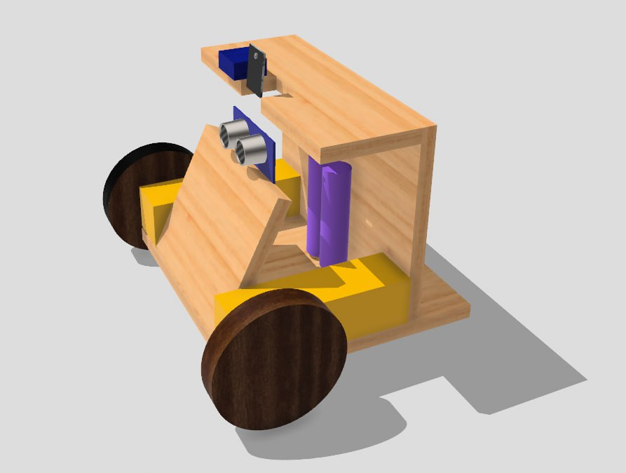
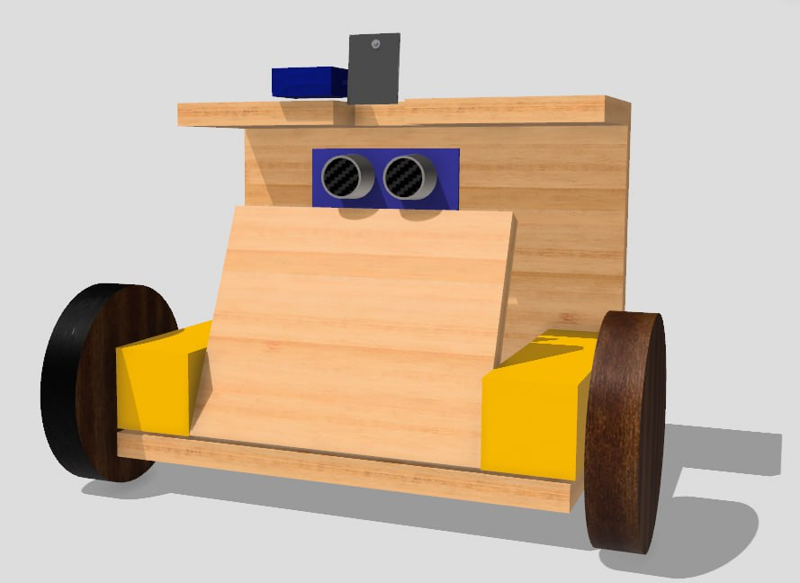
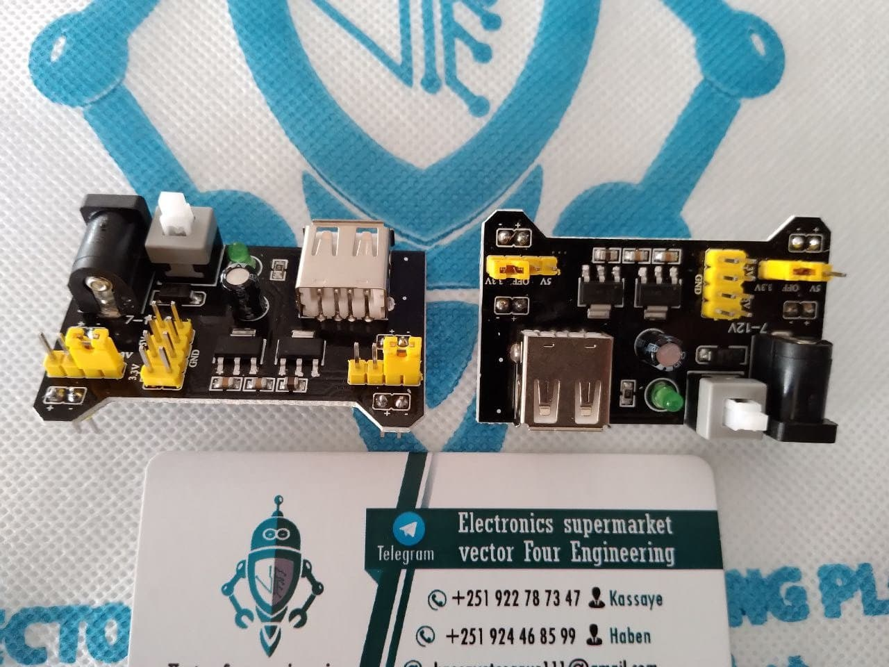

# Smart Surveillance System with Remote Control 🎥

Welcome to the official repository for my **Smart Surveillance System with Remote Control and Live Video Feedback**.  
This project is part of my academic integrated final-year work and demonstrates IoT, embedded systems, and real-time monitoring systems.

---

## 🔹 Project Overview

This project enables **remote surveillance** using an **ESP32-CAM**.  
Users can monitor live video feeds and control camera movement from a distance, ensuring security for homes or offices.  

**Problem Solved:** Traditional security systems lack flexibility, require manual observation, and are often expensive.  
This system offers a **low-cost, IoT-enabled real-time monitoring solution** with remote control capabilities.



---

## 🔹 Key Features

- Live video streaming from ESP32-CAM  
- Remote pan/tilt camera control  
- Motion detection alerts (optional)  
- Compact and energy-efficient design  
- Accessible via Wi-Fi network



---

## 🛠️ Tech Stack & Components

**Hardware:**

- ESP32-CAM microcontroller  
- Pan/Tilt servo motors  
- Wi-Fi router / network  
- Power supply & enclosure  

**Software / Firmware:**

- Embedded C / Arduino IDE  
- ESP32-CAM libraries  
- Optional: Mobile/web interface for remote control



---

## 🔹 System Architecture

```text
Camera → ESP32-CAM → Wi-Fi → Remote Device (Mobile/Web) → User Control

Flow:

1. ESP32-CAM streams live video
2. Remote device receives video feed
3. User sends pan/tilt commands
4. ESP32-CAM moves servo motors accordingly
5. Optional: Motion detection triggers alerts
